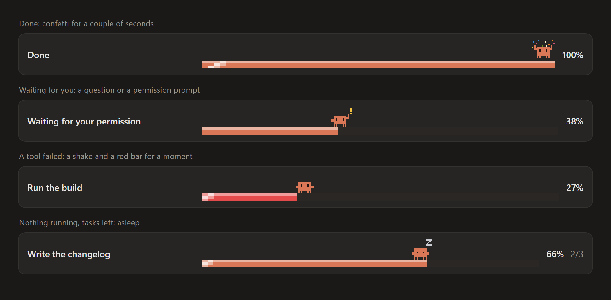

# pixel-crew

A pixel-art progress bar with the Claude mascot, and a side panel that turns your subagents into a little crew of characters, for [Claude Code](https://claude.com/claude-code).


## What it does

**A progress band above the prompt.** While Claude works, the band shows what it is doing right now ("Editing register.tsx", "Running the tests"), a pixel progress bar with a light sweeping across it, and the percentage. The mascot walks along the bar, right at the edge of what is done, and the bar glides to each new value instead of jumping. When Claude delegates to subagents it becomes the **boss**: it grows, puts on a crown and cape, the bar turns purple, and a counter shows how many subagents are done (`1/3`).


**Moods.** The mascot reacts to what happens in the session:

- **Done:** when a turn finishes well, it jumps among confetti at 100% for a couple of seconds.
- **Waiting for you:** when Claude asks a question or needs your permission, it raises a hand with a `!`.
- **Something failed:** when one of Claude's tools fails, it shakes and the bar turns red for a moment.
- **Asleep:** when nothing is running but the task list still has work, it dozes off.



**An Agents panel.** Every subagent gets a row: its character, its role, the model and effort, what it is doing, context used, tokens, estimated cost, time, and its own progress bar. Totals for cost, tokens and time sit on top. The panel opens by itself when the first subagent starts.


**The crew.** Each subagent gets a role from the first keyword in its description (English, Portuguese and Spanish keywords are understood):

| Character | Role | Picked for |
| --- | --- | --- |
| Headphones and laptop | `developer` | build, implement, fix, refactor, create, write |
| Beret, brush and palette | `artist` | design, draw, icons, logo, UI, CSS, visuals |
| Explorer hat and lantern | `researcher` | research, explore, search, read, analyze, plan |
| Hard hat and wrench | `worker` | anything else |
| Safety goggles and clipboard | `tester` | test, verify, debug, review, audit |
| Screen robot | `codex` | anything delegated to Codex |
| Crown, cape and scepter | `boss` | Claude itself, while it delegates (never a subagent) |

**Progress.** If Claude or a subagent keeps a task list, the bar follows it exactly. Without one, the bar is an estimate that advances with each step and stays under 90% until the work is really done.

## Install

The plugin needs a Claude Code build with function-hook plugins (the plugin API is early access). It was built and tested on Claude Code **2.1.293**, in the desktop app's Code tab and in the terminal.

In a terminal session of Claude Code:

```
/plugin install pixel-crew --marketplace Trackszx/pixelcrew
```

Answer `y` to add the marketplace and pick the user scope. Or, from your shell:

```bash
claude plugin marketplace add Trackszx/pixelcrew
claude plugin install pixel-crew@pixelcrew
```

Once installed at the user scope it also loads in the desktop app's Code tab. If the installer says an option is not set yet, that is the Language option: it already defaults to `auto`, so you can skip it.

## Commands

| Command | What it does |
| --- | --- |
| `/crew` | Opens the Agents panel |
| `/crew-clear` | Clears the task list and the agents |

## Language

The band and the panel speak **English**, **Portuguese** and **Spanish**. The `Language` option (in `/config`, or `pluginConfigs` in your settings) is `auto` by default, which follows Claude Code's `language` setting, then `LC_ALL` / `LC_MESSAGES` / `LANG`, then your system's language. Anything else falls back to English. Set it to `en`, `pt` or `es` to pin one.

## Good to know

- **It costs no tokens.** Everything is drawn locally. The plugin only listens to events that already happen (a subagent starts, a model step, a tool call, a turn ends) and passes them on unchanged: it adds nothing to the prompt and makes no model calls.
- **Costs are estimates.** They come from a price table at the top of [`hooks/register.tsx`](hooks/register.tsx); adjust it if your prices differ. The context percentage assumes a 200k window.
- The animation is a frame counter that ticks about three times a second, and only while something is working or a mood is showing (a sleeping mascot ticks slower).

## Development

```
hooks/art.ts        sprites, palette and the pixel bar (SVG)
hooks/i18n.ts       every text in English, Portuguese and Spanish
hooks/register.tsx  the hooks: state, roles, progress, band and panel
types/index.d.ts    the plugin's state contract
tests/              tests run with `claude plugin test .`
```

```bash
claude plugin validate .
claude plugin test .
```

To try your changes, load the folder with `claude --plugin-dir <path to this folder>`.

## License

[MIT](LICENSE). Not affiliated with Anthropic or OpenAI; Claude and Codex are trademarks of their owners.
